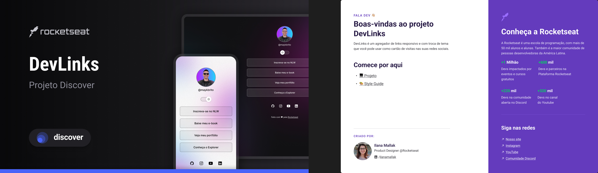

# Projeto MK Britto

<h1 align="center"> DevLinks </h1>

Programa exclusivo e gratuito, promovido pela Rocketseat para ensino de tecnologias web.

<a href="#-tecnologias">Tecnologias</a>&nbsp;&nbsp;&nbsp;&nbsp;&nbsp;&nbsp;
<a href="#-projeto">Projeto</a>&nbsp;&nbsp;&nbsp;&nbsp;&nbsp;&nbsp;
<a href="#memo-licança">Licença</a>

  
  

   

  

  

##Tecnologias

Esse projeto foi desenvolvido com as seguintes tecnologias:

-HTML e CSS
-JavaScript
-Git e Github
-Figma

## Projeto

O DevLinks é um projeto de links para usar como cartão de visitas online.

## Layout

Você pode visualizar o Layout do projeto através [DESSE LINK] (https://www.figma.com/design/zmgFU6D17fn9AGiLorPkAV/DevLinks-%E2%80%A2-Projeto-Discover--Community-?node-id=0-1&p=f&t=nIasmP3BRVZ1k50p-0). É necessário ter conta no Figma.

## :memo: Licença

Esse projeto está sob a licença MIT.
